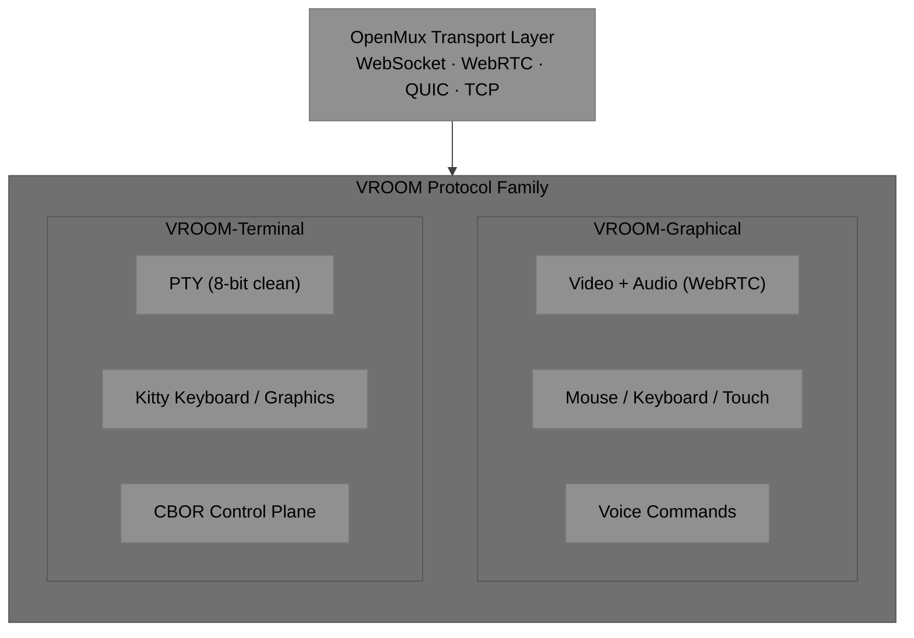

# VROOM

**Virtual Remoting Over OpenMux**

*It's like having a Zoom call with your coding agent.*

Version: 0.2.0-draft | Status: Draft | Date: 2026-03-28

---

## What is VROOM?

VROOM is a protocol family and runtime for interactive sessions with AI agents, built on [OpenMux](https://github.com/visionik/socketpipe/tree/openmux), a transport-agnostic channel multiplexing standard.

VROOM comprises two companion protocols that can run over the same OpenMux connection:

| Protocol | Spec | Description |
|----------|------|-------------|
| **VROOM-Graphical** | [VROOM-Graphical.md](./VROOM-Graphical.md) | Remote desktop/browser access — video, audio, mouse, keyboard, touch, voice commands |
| **VROOM-Terminal** | [VROOM-Terminal.md](./VROOM-Terminal.md) | Terminal access — PTY, capability negotiation, Kitty keyboard/graphics, CBOR control plane |

## Architecture

- **Single `vroomd` daemon** supports both protocols simultaneously
- **Shared OpenMux connection** — graphical and terminal channels coexist
- **Thin gateways** (`vroom-to-ssh`, `ssh-to-vroom`) planned for adoption

## Reference Implementation

The reference implementation is [voxio-bot](https://github.com/visionik/voxio-bot) (being renamed to vroom-server), built on:

- **Pipecat** — AI pipeline framework (LLM, TTS, STT)
- **aiortc** — Python WebRTC implementation
- **Playwright** — Headless browser for agent screen rendering

## Status

VROOM is in active development. Both protocols are draft and subject to change.

## License

MIT
