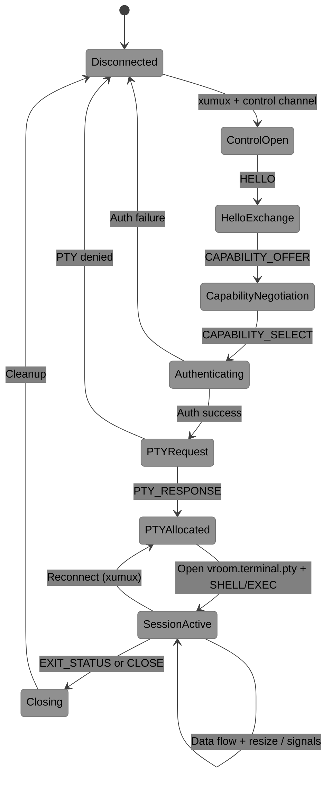

# VROOM-Terminal

**Virtual Remoting Over Open Methods — Terminal Protocol**

*A modern, capability-aware terminal protocol for the age of Kitty, Sixel, and AI agents.*

Official Name: VROOM-Terminal | Companion Protocol: [VROOM-Graphical](./VROOM-Graphical.md)
Transport: [xumux](https://xumux.org) (WebSocket, WebRTC Data Channels, QUIC, TCP, etc.)
Version: 0.2.0-draft | Status: Draft | Date: 2026-03-28

Both protocols can run over the same xumux connection.

---

## Core Channel Types

| Channel | Plane | Description |
|---------|-------|-------------|
| `vroom.terminal.control` | Control | Negotiation, authentication, PTY setup, signals, resize, environment, exit status, etc. |
| `vroom.terminal.pty` | Data | Raw, bidirectional, 8-bit clean byte stream connected directly to the server-side PTY master |

### Why `vroom.terminal.pty` (not `.tty`)?

**PTY = Pseudo Terminal** (specifically the master side). This is the precise technical term used in operating systems and libraries when allocating a full-featured terminal with job control, signals (SIGWINCH, etc.), and process management.

- The shell runs on the **slave** side; the protocol speaks to the **master**.
- Using `.pty` is clearer for implementers and consistent with SSH (`pty-req`), libraries (`portable-pty`, `creack/pty`, etc.).

---

## 1. Detailed Message Formats (TLV Structure) for `vroom.terminal.control`

All messages on the control channel use this binary TLV header (8 bytes):

**Header:**

| Field | Size | Type | Description |
|-------|------|------|-------------|
| type | 4 bytes | uint32 | Message type (big-endian) |
| length | 4 bytes | uint32 | Payload length only (big-endian) |

### Core Message Types

| Type (hex) | Name | Direction | Payload Type | Description |
|------------|------|-----------|--------------|-------------|
| `0x00000001` | HELLO | Both | CBOR/JSON | Version handshake |
| `0x00000002` | CAPABILITY_OFFER | Both | CBOR | Capability negotiation |
| `0x00000003` | CAPABILITY_SELECT | Server → Client | CBOR | Final agreed capabilities |
| `0x00000010` | AUTH_REQUEST | Client → Server | CBOR | Authentication |
| `0x00000020` | PTY_REQUEST | Client → Server | CBOR | Allocate PTY |
| `0x00000021` | PTY_RESPONSE | Server → Client | CBOR | PTY allocation result |
| `0x00000030` | WINDOW_RESIZE | Client → Server | Binary struct | rows, cols, xpix, ypix |
| `0x00000031` | SIGNAL | Client → Server | uint8 | POSIX signal number |
| `0x00000040` | SET_ENV | Client → Server | CBOR map | Environment variables |
| `0x00000050` | SHELL_REQUEST | Client → Server | CBOR | Start shell |
| `0x00000051` | EXEC_REQUEST | Client → Server | CBOR | Execute command |
| `0x000000F0` | EXIT_STATUS | Server → Client | CBOR | Exit code + signal |
| `0x000000FF` | ERROR | Both | CBOR | Error reporting |

### WINDOW_RESIZE (0x00000030) — Binary Payload

Simple binary struct (no CBOR):

| Field | Size | Type | Description |
|-------|------|------|-------------|
| rows | 2 bytes | uint16 | Terminal rows |
| cols | 2 bytes | uint16 | Terminal columns |
| pixel_width | 2 bytes | uint16 | Pixel width (0 if unknown) |
| pixel_height | 2 bytes | uint16 | Pixel height (0 if unknown) |

Complex messages (PTY_REQUEST, capabilities, auth, etc.) use **CBOR** (preferred) or JSON for development.

**Control Encoding:** The HELLO message is always sent as JSON (for bootstrapping). The client includes a `control_encoding` field listing supported encodings in preference order. The server's HELLO response selects one, and all subsequent messages use that encoding. This negotiation mechanism is shared with [VROOM-Graphical](./VROOM-Graphical.md).

HELLO example:

```json
{
  "protocol": "vroom-terminal",
  "version": 1,
  "control_encoding": ["cbor", "json"]
}
```

Server response:

```json
{
  "protocol": "vroom-terminal",
  "version": 1,
  "control_encoding": "cbor"
}
```

After HELLO, all subsequent control messages on `vroom.terminal.control` use the selected encoding.

---

## 2. Exact Capability Negotiation Schema

Capability exchange occurs via CAPABILITY_OFFER + CAPABILITY_SELECT.

Schema (shown as JSON for readability — transmitted in the negotiated `control_encoding`):

```json
{
  "protocol_version": 1,
  "terminal": {
    "name": "kitty",
    "unicode_version": "15.1",
    "truecolor": true
  },
  "kitty": {
    "keyboard": {
      "supported_levels": [1, 2, 3],
      "preferred_level": 3
    },
    "graphics": true,
    "sixel": true,
    "synchronized_output": true
  },
  "mouse": ["sgr", "kitty", "xterm"],
  "features": [
    "bracketed_paste",
    "osc52_clipboard",
    "focus_reporting",
    "hyperlinks",
    "progress_indicator"
  ],
  "extensions": {
    "structured_keys": true,
    "reconnect": true,
    "zstd_compression": true
  }
}
```

The server replies with **CAPABILITY_SELECT**, containing the final intersection of supported features (especially Kitty keyboard level and graphics).

---

## 3. State Machine



**Key points:**

- **CapabilityNegotiation** is mandatory
- `vroom.terminal.pty` channel is opened only after successful PTY_RESPONSE
- Reconnection (via xumux) can resume directly into SessionActive

---

## 4. Comparison: VROOM-Terminal vs SSH vs Mosh

| Feature | VROOM-Terminal | OpenSSH | Mosh |
|---------|---------------|---------|------|
| Transport | Any (WS, WebRTC, QUIC, TCP…) | TCP only | UDP only |
| Kitty Keyboard Protocol | Native (Level 3 first-class) | Passthrough only | None |
| Kitty Graphics / Sixel | Full transparent passthrough | Works | No |
| Browser / WebRTC native | Excellent | Poor | No |
| Reconnection / Roaming | Excellent (xumux) | Poor | Excellent |
| Multiplexing (multiple shells) | Native & clean | Good (ControlMaster) | Single session |
| Latency on lossy lines | Very good | Good | Excellent (predictive) |
| Unified with Graphical | Yes (same connection) | No | No |
| SFTP / Forwarding | Native channels | Excellent | None |
| Modern terminal experience | Best-in-class | Good | Basic |

---

## 5. Reference Implementation Recommendations

### Server (`vroom-terminald`)

- **Strongly recommended:** Rust (`tokio` + `portable-pty` or `pty-process` + `ciborium` for CBOR)
- **Alternative:** Go (`github.com/creack/pty`)

### Clients

- **Web:** TypeScript + enhanced xterm.js (or custom renderer) with Kitty keyboard/graphics support
- **Native / Desktop:** Rust (share code with server) or embed Kitty/WezTerm components
- **CLI:** `vroom term user@host` (SSH-like interface)

### Recommended Architecture

- Single `vroomd` daemon supporting both VROOM-Graphical and VROOM-Terminal
- Shared `vroom-protocol` and xumux libraries
- Build thin gateways (`vroom-to-ssh` and `ssh-to-vroom`) for easy adoption

### Development Phases (suggested)

1. Control channel + raw PTY passthrough
2. Capability negotiation + Kitty keyboard transparency
3. Authentication + exit status
4. SFTP, agent forwarding, reconnection
5. Hybrid graphical+terminal sessions

---

## Status

VROOM-Terminal is in active development. The protocol is draft and subject to change.

## License

MIT
